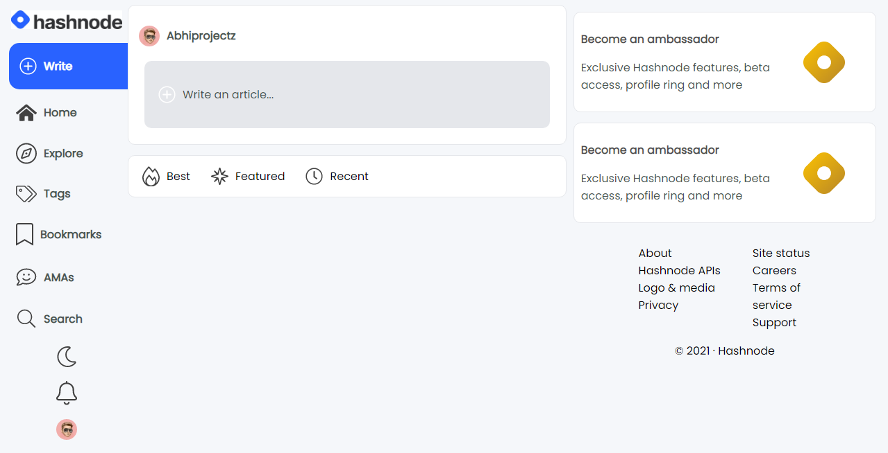

This is basically the hashnode front page clone using just CSS.

Hello there!

Ever thought to clone hashnode frontend page clone by using just pure CSS ?

This is how you would do that, this is hashnode page frontend clone using pure CSS.

# Tech used:

+ CSS
+ HTML

# Preview

# STAR this if you like.